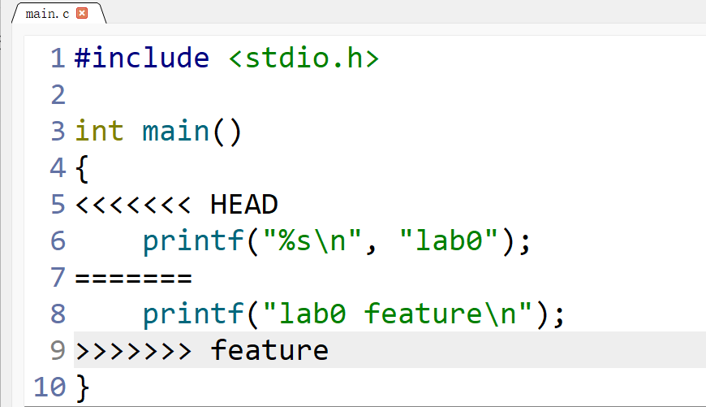
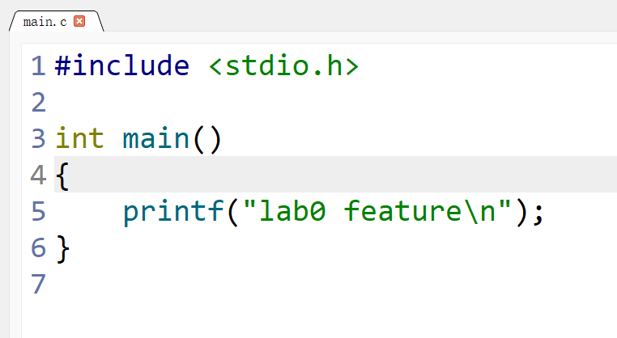

# Lab0 实验报告

姓名：李天呈　学号：25803050053

## 问题回答

**1. 之前是否有多人协同开发经历？**

没有，之前没有参与过多人协同开发。

**2. Git 为什么分为“暂存”和“提交”两个步骤？**

暂存区可以选择本次要提交的修改，而不必一次提交工作目录里的全部变化。提交则把暂存的内容保存为一个版本。这样可以把不同目的的修改分开，方便查看和回退。

**3. `git branch` 和 `git branch -a` 有什么区别？**

`git branch` 显示本地分支，`git branch -a` 还会显示远程跟踪分支，例如 `remotes/origin/main`。这些是本地保存的远程分支信息；查看最新变化前，需要先运行 `git fetch`。

## 选读内容

[Commit Message 规范](https://www.ruanyifeng.com/blog/2016/01/commit_message_change_log.html)介绍了提交说明的格式。标题可以用 `feat`、`fix` 等类型说明修改的目的，正文解释原因。清楚的提交说明便于查看历史，也有助于生成更新日志。

[语义化版本](https://semver.org/lang/zh-CN/)使用“主版本号.次版本号.修订号”的格式。不兼容的 API 修改增加主版本号，向下兼容的新功能增加次版本号，向下兼容的问题修复增加修订号。

学习 Git 可以记录修改过程，在出错时找回之前的版本。分支也能让不同修改分别进行，再合并到一起，减少多人协作时直接覆盖文件的问题。

## 实验步骤

1. 从课程模板创建个人仓库 [ICS-GitLab](https://github.com/DitaMirika/ICS-GitLab)，并克隆到本地。
2. 将 `main.c` 的输出改为 `lab0`，执行 `git add main.c` 和 `git commit -m "feat: print lab0"`。
3. 执行 `git switch -c feature`，将输出改为 `lab0 feature`，提交这次修改。
4. 切换回 `main`，把同一行改为 `printf("%s\n", "lab0");` 并提交。此时输出仍为 `lab0`。
5. 在 `main` 执行 `git merge feature`，出现 `CONFLICT (content): Merge conflict in main.c`。两个分支都修改了同一行，Git 无法自动决定保留哪一个版本。编辑器中的冲突如下：



6. 删除冲突标记，保留 feature 分支的输出，然后执行 `git add main.c` 和 `git commit -m "merge: feature into main"` 完成合并。



本地使用 GCC 编译运行，初次修改的输出为 `lab0`，feature 分支和合并后的输出均为 `lab0 feature`。最终代码为：

```c
#include <stdio.h>

int main()
{
    printf("lab0 feature\n");
}
```
